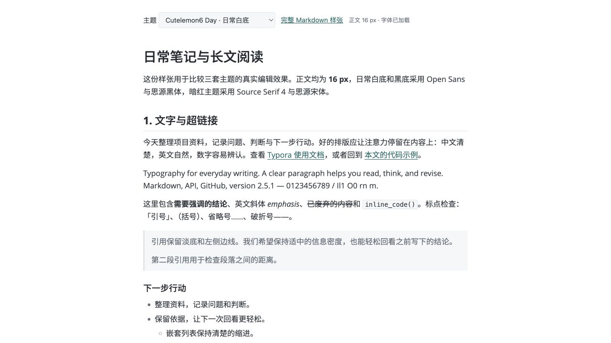
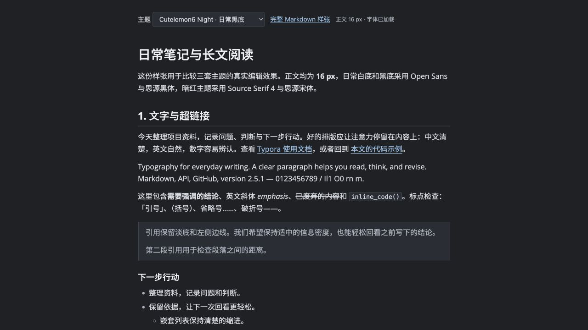
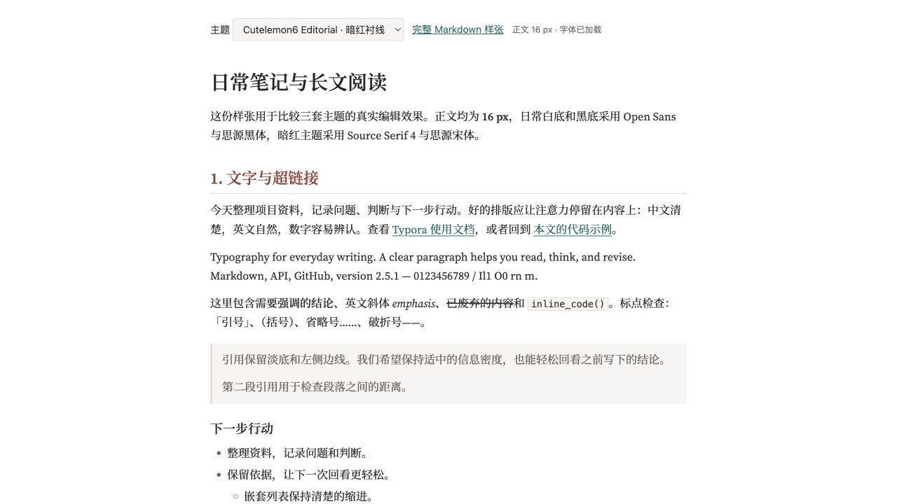

# Cutelemon6 Typora Themes

[English](README.md) · [设计原则](docs/DESIGN.zh-CN.md) · [字体来源与授权](THIRD_PARTY_NOTICES.md)

面向日常编辑与长文阅读的三套 Typora 主题：清楚的白底、平衡的黑底，以及带暗红章节标题的衬线风格。

三套主题统一采用 **16 px 正文**、**680 px 实际文字区域**和 **28 / 22 / 18 px 标题层级**。通过字体、间距和少量有明确用途的颜色，让页面具有稳定的阅读节奏。

| Day · 日常白底 | Night · 日常黑底 | Editorial · 暗红衬线 |
| --- | --- | --- |
| [](assets/previews/day.png) | [](assets/previews/night.png) | [](assets/previews/editorial.png) |
| 白底、非衬线、墨青链接 | 炭灰底、非衬线、浅蓝链接 | 白底、衬线、暗红标题、墨青链接 |

*预览图由本仓库实际 CSS 和字体在浏览器中渲染。点击图片可查看原尺寸。*

## 选择主题

| Typora 菜单名称 | 正文字体 | 行高 | 超链接 |
| --- | --- | --- | --- |
| **Cutelemon6 Day** | Open Sans＋思源黑体 CN Regular | 1.65 | 墨青 `#0F6B68` |
| **Cutelemon6 Night** | Open Sans＋思源黑体 CN Regular | 1.65 | 浅石墨蓝 `#91BDE4` |
| **Cutelemon6 Editorial** | Source Serif 4 Regular＋思源宋体 CN Medium | 1.70 | 墨青 `#0F6B68` |

Day 与 Night 组成日常编辑的明暗配对。Editorial 保留相同的标题尺寸和版心，用宋体与暗红色 `#963D36` 建立更接近书页的阅读气质。

中文字体采用中国大陆简体字形规范。字体随主题提供并从本地加载，无需安装到系统字体库。代码使用系统可用的等宽字体，例如 Menlo 或 Consolas。

## 安装

1. [下载仓库 ZIP](https://github.com/Cutelemon6/cutelemon6-typora-themes/archive/refs/heads/main.zip) 并解压。
2. 在 Typora 中打开 **偏好设置／设置 → 外观 → 打开主题文件夹**。
3. 将 **`themes/` 里面的全部内容**复制进去，三个 CSS 文件与 `cutelemon6` 资源文件夹必须处于同一级。
4. 保存当前文档并重启 Typora，在**主题**菜单中选择所需主题。

```text
Typora 主题文件夹/
├── cutelemon6-day.css
├── cutelemon6-night.css
├── cutelemon6-editorial.css
└── cutelemon6/
    ├── base.css
    ├── fonts-sans.css
    ├── fonts-serif.css
    ├── fonts/
    └── licenses/
```

要使用设计中的尺寸，请将 Typora 字体大小设为**自动**，缩放设为 **100%**。自定义字号可能覆盖主题默认值。打开[排版样张](examples/showcase.md)，可以检查标题、链接、列表、表格、代码、公式和脚注。

## 随系统切换明暗

在支持此功能的 Typora 版本中，将浅色主题指定为 **Cutelemon6 Day**、深色主题指定为 **Cutelemon6 Night**，并启用深色模式下的独立主题。Typora 会按这组选择跟随系统外观。[官方说明](https://support.typora.io/Dark-Mode/)

需要衬线风格时，手动选择 **Cutelemon6 Editorial**。手动选择可能更新当前系统外观对应的主题；再次选择 Day 或 Night 即可恢复日常配对。

三个固定入口让菜单保持简洁。三套主题共用一份排版文件，间距或表格样式的修正会同时作用于整个系列。

## 排版细节

- **标题：**全部左对齐；只在 H2 下保留细横线；H2 上方 32 px、下方 10 px。
- **段落：**段后 12 px；列表项之间 4 px。
- **链接：**默认显示 1 px 下划线，悬停时加粗；访问前后颜色一致。
- **引用：**淡底、左侧边线、正常直立文字。
- **代码：**13.5 px 等宽字体、1.6 行高、轻边框，并提供 CodeMirror 语法配色。
- **表格：**15 px 文字、轻边框与淡色隔行背景。
- **打印：**三套主题均使用白底，正文默认 10.5 pt；Editorial 保留暗红章节标题。纸张与页边距继续由 Typora 导出设置控制。

## 自定义

各主题入口用 CSS 变量设置字体和配色。修改入口中的 `--cutelemon6-link` 可调整链接颜色；共用间距和元素样式位于 [`themes/cutelemon6/base.css`](themes/cutelemon6/base.css)。

个人调整建议使用 Typora 的[主题专属 user CSS](https://support.typora.io/Add-Custom-CSS/)，以便更新主题时保留。例如，新建 `cutelemon6-day.user.css`：

```css
:root {
  --cutelemon6-link: #0f6b68;
}

#write {
  max-width: 744px; /* 包含左右各 32 px 内边距 */
}
```

[设计原则](docs/DESIGN.zh-CN.md)说明这些默认值背后的取舍，也为继续扩展主题提供判断依据。

## 预览与验证范围

从仓库根目录运行下面的命令，再打开本机预览地址：

```bash
python3 -m http.server 8000 --bind 127.0.0.1
# 打开 http://127.0.0.1:8000/preview/
```

浏览器预览覆盖基础 Markdown 排版。公式、脚注、编辑器交互和 CodeMirror 语法高亮，请在 Typora 中使用完整样张检查。

已在 macOS 浏览器中核对随包 CSS、本地字体加载、16 px 正文、三套配色及基础 Markdown 布局。**Typora 原生编辑与 PDF 分页仍待验证，Windows 和 Linux 尚未实测。** 系统等宽字体与文字栅格化差异可能影响观感。

检查资源引用和字体文件完整性：

```bash
python3 scripts/check.py
```

## 授权与致谢

原创主题 CSS、文档、样张、预览页面和脚本采用 [MIT](LICENSE) 授权。

**第三方字体保留各自授权，不属于 MIT 范围。** 思源黑体、思源宋体和 Source Serif 4 使用 SIL OFL 1.1；随包 Open Sans 版本使用 Apache 2.0。仓库直接提供上游原版字体二进制文件，并保留版权声明和许可。具体来源与 SHA-256 校验值见[第三方说明](THIRD_PARTY_NOTICES.md)和[字体清单](font-manifest.json)。

这是独立主题项目，未获得 Typora 或字体作者的赞助、背书。
